# Manual de Usuario de DentAssist

## Introducción
Bienvenido al manual de usuario de DentAssist, una aplicación web diseñada para gestionar eficientemente los procesos de una clínica dental. Este manual le guiará a través de las funcionalidades principales del sistema, organizadas por operaciones CRUD.

## Índice
1. [Gestión de Pacientes](#gestion-de-pacientes)
   - [Crear Paciente](#crear-paciente)
   - [Ver Detalles de Paciente](#ver-detalles-de-paciente)
   - [Editar Paciente](#editar-paciente)
   - [Eliminar Paciente](#eliminar-paciente)
2. [Gestión de Odontólogos](#gestion-de-odontologos)
   - [Crear Odontólogo](#crear-odontologo)
   - [Ver Detalles de Odontólogo](#ver-detalles-de-odontologo)
   - [Editar Odontólogo](#editar-odontologo)
   - [Eliminar Odontólogo](#eliminar-odontologo)
3. [Gestión de Planes de Tratamiento](#gestion-de-planes-de-tratamiento)
   - [Crear Plan de Tratamiento](#crear-plan-de-tratamiento)
   - [Ver Detalles de Plan de Tratamiento](#ver-detalles-de-plan-de-tratamiento)
   - [Editar Plan de Tratamiento](#editar-plan-de-tratamiento)
   - [Eliminar Plan de Tratamiento](#eliminar-plan-de-tratamiento)
4. [Gestión de Turnos](#gestion-de-turnos)
   - [Crear Turno](#crear-turno)
   - [Ver Detalles de Turno](#ver-detalles-de-turno)
   - [Editar Turno](#editar-turno)
   - [Eliminar Turno](#eliminar-turno)

## Gestión de Pacientes

### Crear Paciente
1. Navegue a la sección de "Pacientes" en el menú principal.
2. Haga clic en "Nuevo Paciente".
3. Complete el formulario con la información del paciente.
4. Haga clic en "Guardar" para crear el paciente.

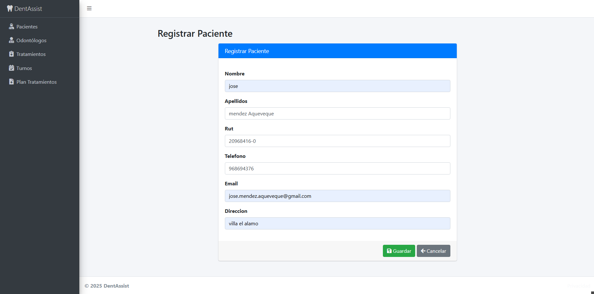

### Ver Detalles de Paciente
1. En la lista de pacientes, haga clic en el nombre del paciente para ver los detalles.

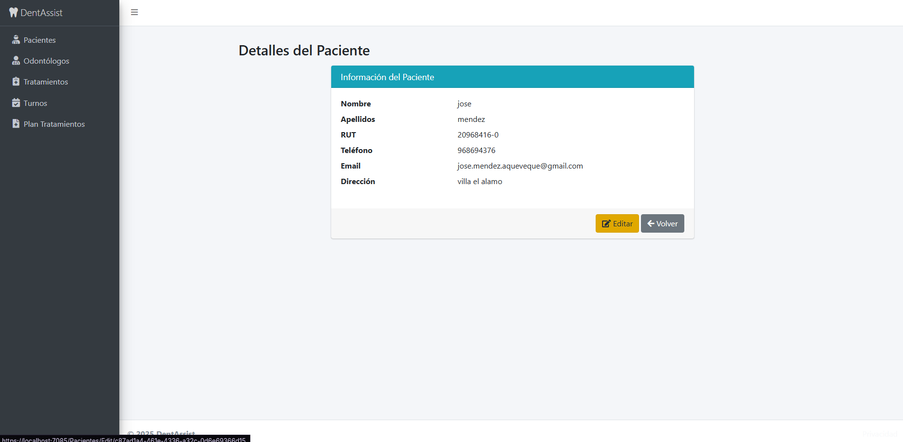

### Editar Paciente
1. Seleccione el paciente que desea editar.
2. Haga clic en "Editar".
3. Modifique la información necesaria y haga clic en "Guardar".

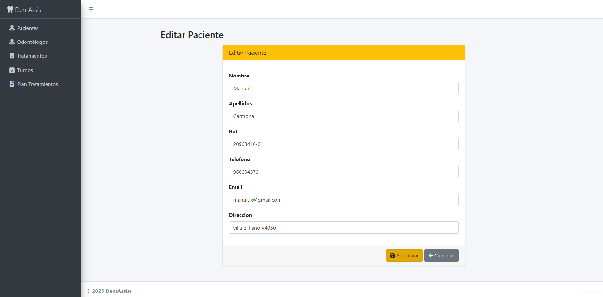

### Eliminar Paciente
1. Seleccione el paciente que desea eliminar.
2. Haga clic en "Eliminar" y confirme la acción.

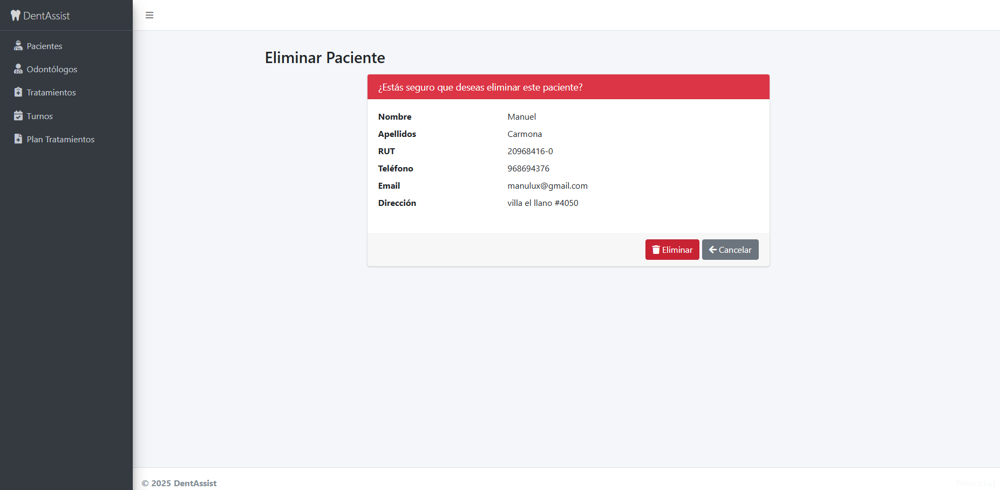

## Gestión de Odontólogos

### Crear Odontólogo
1. Navegue a la sección de "Odontólogos" en el menú principal.
2. Haga clic en "Nuevo Odontólogo".
3. Complete el formulario con la información del odontólogo.
4. Haga clic en "Guardar" para crear el odontólogo.

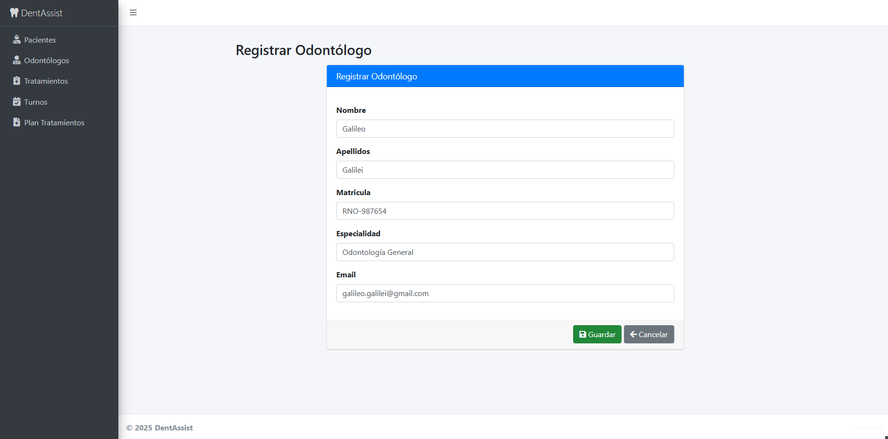

### Ver Detalles de Odontólogo
1. En la lista de odontólogos, haga clic en el nombre del odontólogo para ver los detalles.

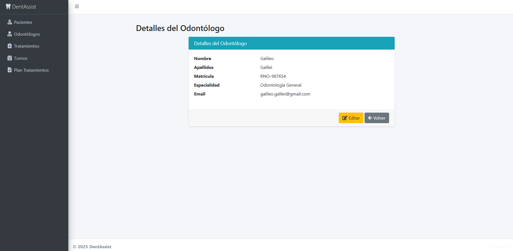

### Editar Odontólogo
1. Seleccione el odontólogo que desea editar.
2. Haga clic en "Editar".
3. Modifique la información necesaria y haga clic en "Guardar".

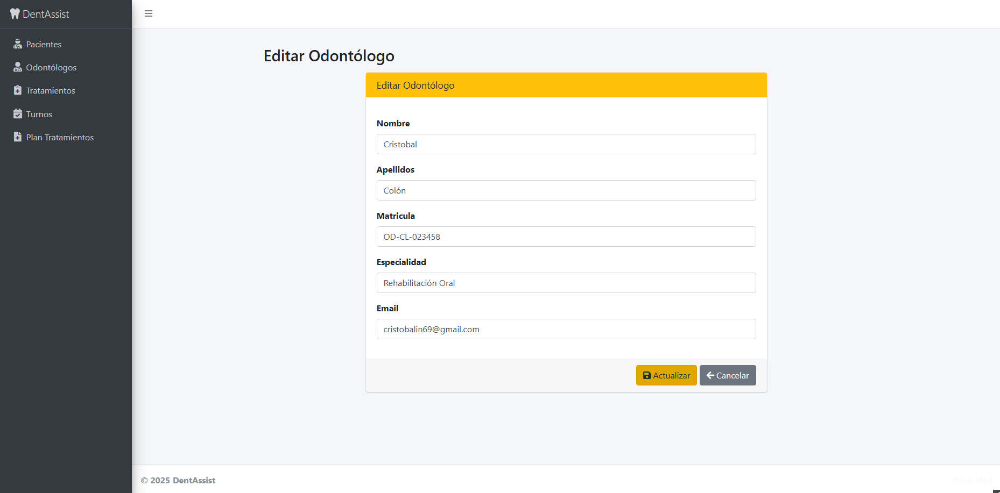

### Eliminar Odontólogo
1. Seleccione el odontólogo que desea eliminar.
2. Haga clic en "Eliminar" y confirme la acción.

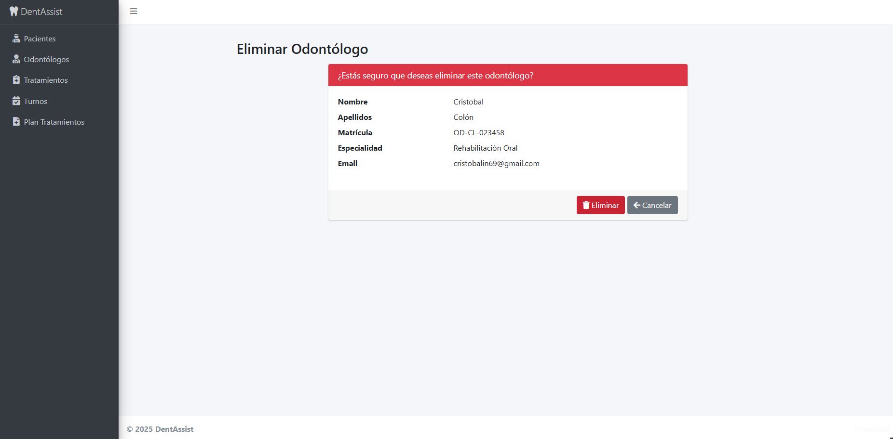

## Gestión de Planes de Tratamiento

### Crear Plan de Tratamiento
1. Navegue a la sección de "Planes de Tratamiento" en el menú principal.
2. Haga clic en "Nuevo Plan de Tratamiento".
3. Complete el formulario con la información del plan.
4. Haga clic en "Guardar" para crear el plan.

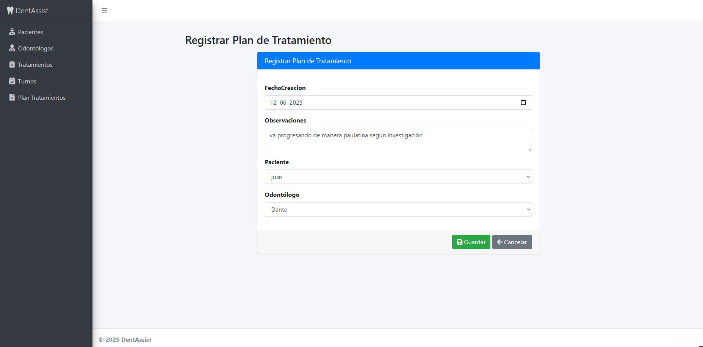

### Ver Detalles de Plan de Tratamiento
1. En la lista de planes, haga clic en el plan para ver los detalles.

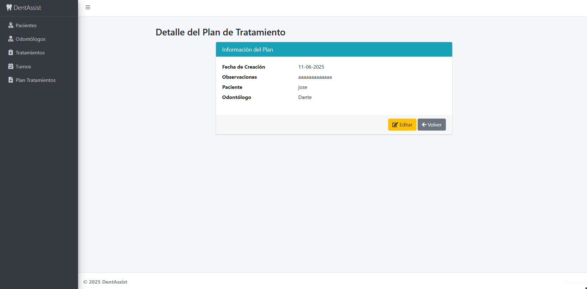

### Editar Plan de Tratamiento
1. Seleccione el plan que desea editar.
2. Haga clic en "Editar".
3. Modifique la información necesaria y haga clic en "Guardar".

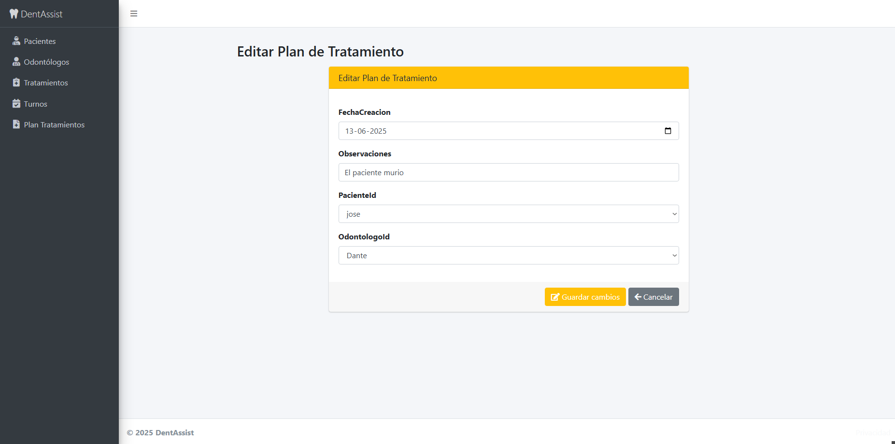

### Eliminar Plan de Tratamiento
1. Seleccione el plan que desea eliminar.
2. Haga clic en "Eliminar" y confirme la acción.

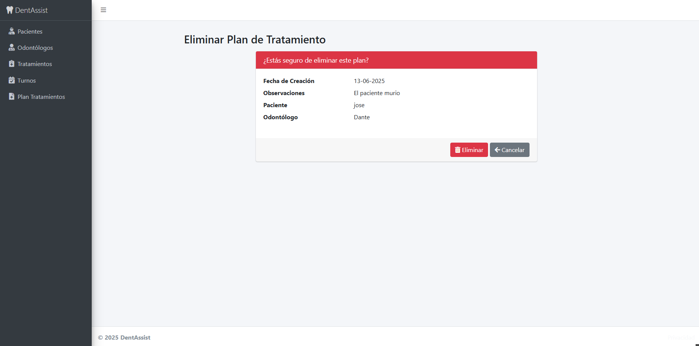

## Gestión de Turnos

### Crear Turno
1. Navegue a la sección de "Turnos" en el menú principal.
2. Haga clic en "Nuevo Turno".
3. Complete el formulario con la información del turno.
4. Haga clic en "Guardar" para crear el turno.

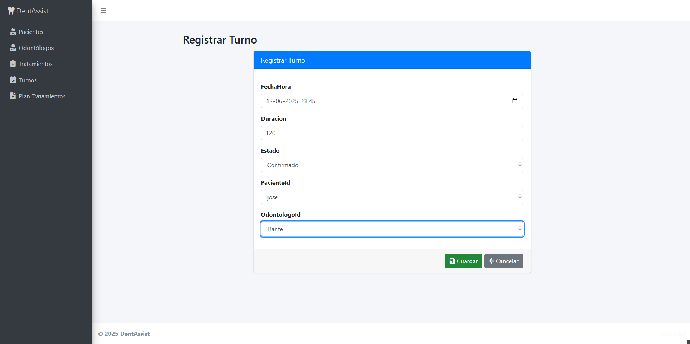

### Ver Detalles de Turno
1. En la lista de turnos, haga clic en el turno para ver los detalles.

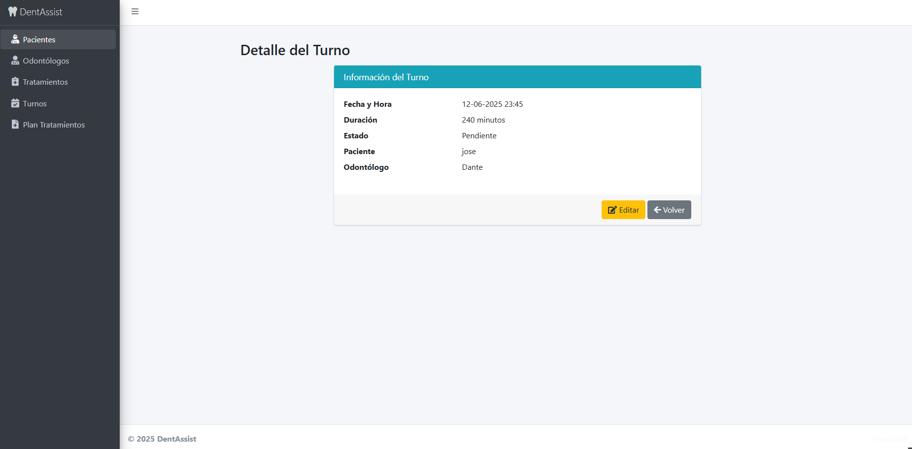

### Editar Turno
1. Seleccione el turno que desea editar.
2. Haga clic en "Editar".
3. Modifique la información necesaria y haga clic en "Guardar".

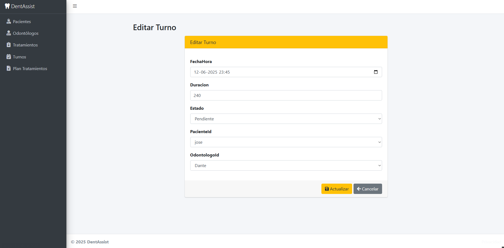

### Eliminar Turno
1. Seleccione el turno que desea eliminar.
2. Haga clic en "Eliminar" y confirme la acción.

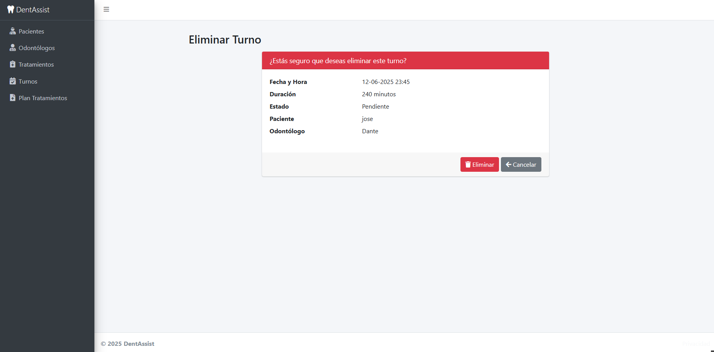

## Conclusión
Este manual cubre las operaciones básicas de gestión dentro de DentAssist. Para más detalles, consulte la documentación adicional proporcionada en el directorio `Docs`.