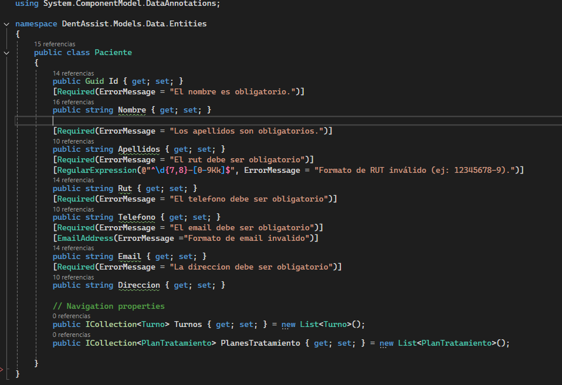
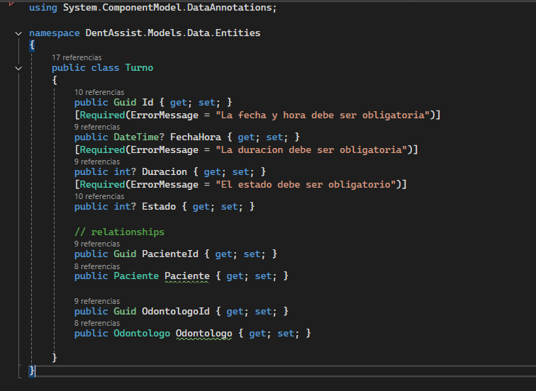
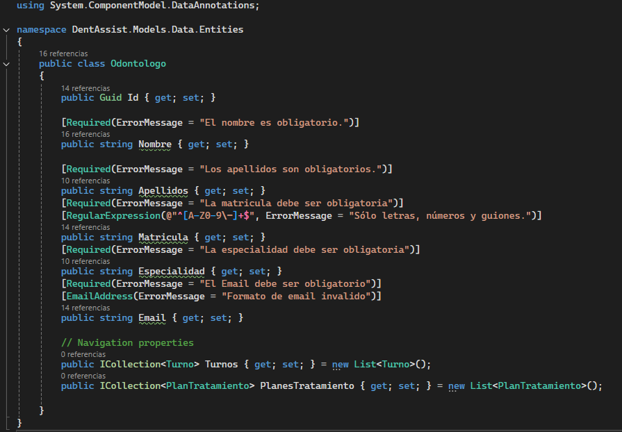
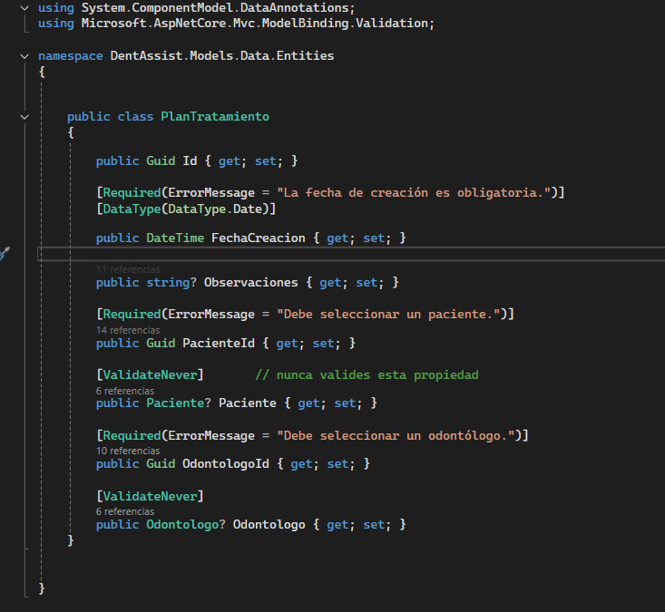
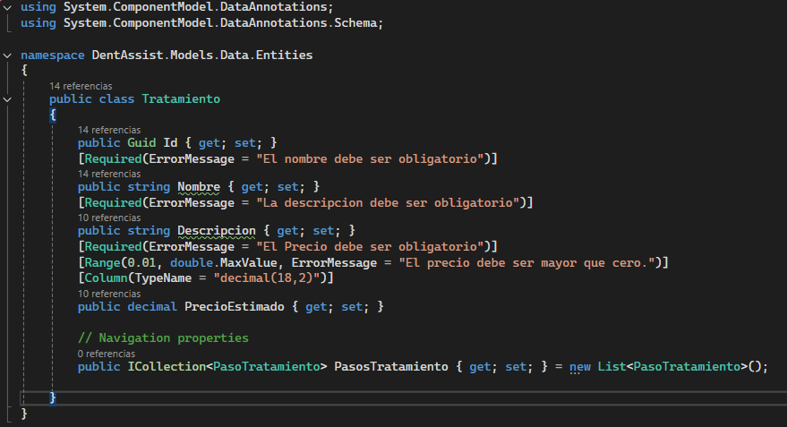

# ✅ Validaciones en Formularios - DentAssist

Este documento describe las reglas de validación utilizadas en el sistema para asegurar la integridad de los datos ingresados.

---

## 🔍 General

- Validaciones aplicadas en cliente (JavaScript/jQuery) y en servidor (DataAnnotations).
- Campos obligatorios marcados con `*`.
- Formularios muestran mensajes de error personalizados.

---

## 🧾 Validaciones por Entidad

### Paciente
- `Nombre`: `[Required]`
- `Apellidos`: `[Required]`
- `RUT`: `[Required]`, formato específico.
- `Teléfono`: `[Required]`
- `Email`: `[Required]`, `[EmailAddress]`
- `Dirección`: `[Required]`

### Turno
- `Duración`: `[Range(5,180)]` minutos.
- `Fecha`: no puede estar vacía.
- `Estado`: enumerado (`Pendiente`, `Confirmado`, etc.) con selección obligatoria.

### Odontólogo
- `Especialidad`: `[Required]`.
- `Correo`: validación de formato.

### Tratamiento
- `Nombre`: requerido, único.
- `Descripción`: campo opcional.
- `Costo`: debe ser un número positivo.

### Plan de Tratamiento
- `PacienteId` y `OdontologoId`: campos seleccionables, no deben contener datos erróneos como dirección o correo (ya corregido).

---

## 📷 Imágenes de Validaciones

A continuación se presentan imágenes que ilustran las validaciones en los formularios:

- **Paciente**: 
- **Turno**: 
- **Odontólogo**: 
- **Tratamiento**: 
- **Plan de Tratamiento**: 

## 📄 Imágenes del Código de las Entidades

A continuación se presentan imágenes del código de las entidades para referencia:

- **Código Paciente**: 
- **Código Turno**: 
- **Código Odontólogo**: 
- **Código Tratamiento**: 
- **Código Plan de Tratamiento**: 